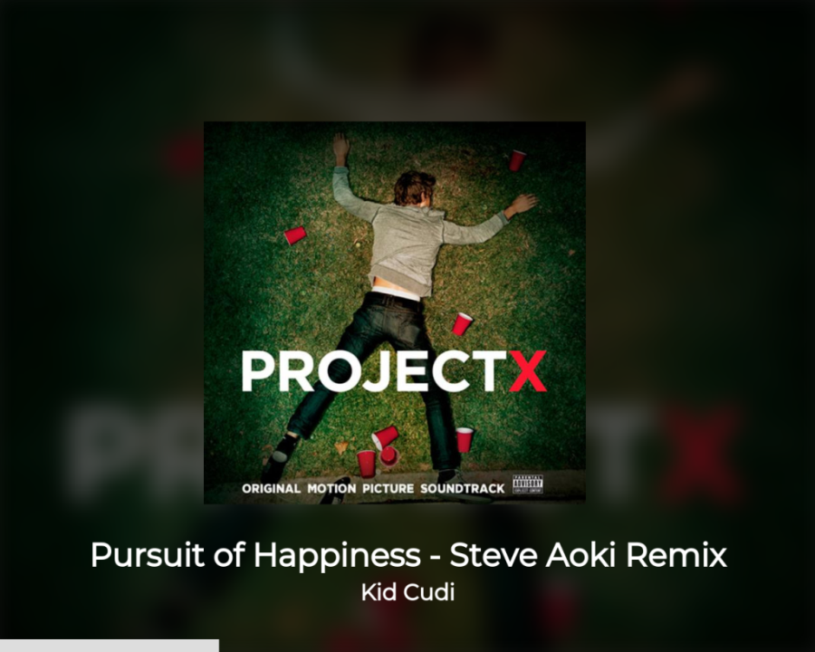

# spotispy

Display currently playing album art from Spotify using their [web API](https://developer.spotify.com/web-api/).

## This fork

Differences in this fork:

-   Uses the web API through the [spotify-web-api-node](https://www.npmjs.com/package/spotify-web-api-node) package
-   Displays a progress bar at the bottom (possible thanks to the usage of the new API)
-   You have to generate the oauth refresh token on your own
-   It does not display the album name seperately because the cover does include it most times

## How it looks like

_Due to limitations in the Spotify API, the max album art size is 600x600._

## How to install

1.  Clone the repo with `git clone https://github.com/l3d00m/spotispy.git`
2.  Install dependencies with `npm install`
3.  Create a file called `.env` in the project root with the secrets (see below)
4.  Run with `npm start`
5.  Optional: Download the [Montserrat font from here](https://github.com/JulietaUla/Montserrat/raw/master/fonts/webfonts/Montserrat-Regular.woff2), rename it to Montserrat.woff2 and put it in the lib directory.

### .env secrets

    # Create a spotify app and paste your client id and secret here (https://developer.spotify.com/my-applications/)
    CLIENT_ID=example-client-id
    CLIENT_SECRET=example-client-secret
    # Generate a oauth refresh token as described in their api docs
    # OR use this handy tool: https://grant.outofindex.com/spotify, but don't forget to paste your client id and secret into the app section there
    REFRESH_TOKEN=

### Multiple monitors?

You can switch between your displays with `Cmd+Shift+Arrow` or `Ctrl+Shift+Arrow` on Windows.
